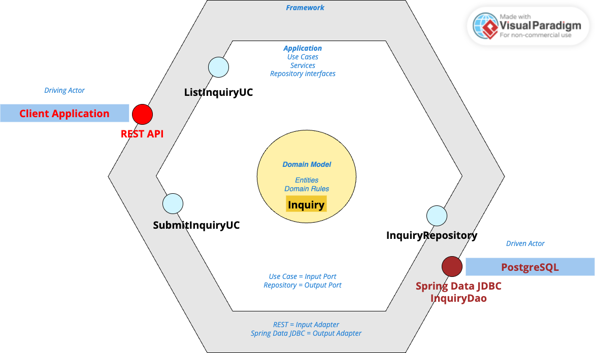

Springsteps
===========

Springstep is the name of the microservice that handles inquiry ingestion and intelligent identity matching.

> Proof of Concept (PoC) for Sping Boot microservice.

## 1. Software Architecture

> Software architecture (SA) decisions and choices.

> Software architecture model: `<project-dir>/doc/architecture/`



SA based on hexagonal architecture, simplified to avoid overengineering for simple project like this.

* Perfect fit for microservice SA.
* Domain model centric architecture based on DDD _(instead of not so expandable layered style)_.
  * Clear responsibilities separation between input and output boundaries of the system. 
  * Extensible to inside (inputs) and outside (outputs) boundaries of the system.
* Strong separation between business logic, integration logic and frameworks (API interfaces, database technologies, etc.).
  * Testability is simple and strongly support by architecture itself.
* Clean code due to clean architecture.

**TODO (Explain SA choices):**

Database
- UUID version 7 as primary key, id
- database migrations

API - REST
- API versioning
- API package (controllers, API model: request/response POJOs)

Common
- `Inquiry` as domain entity and database entity together (for simplicity)
- database access and abstraction: Spring Data Repository - JDBC
  - generated database access code
- automated testing
  - unit tests, functional + integration tests, acceptance tests
  - idea to use test containers framework, bud after quick research its no so out-of-the-box and simple to use as in Quarkus framework
- Spring
  - `@Autowire` applied on the fields in `src/test/`

Crossfunctional 
- `@Transactional` transactions
- logging

---

## 2. Microservice First Setup

See [Launch microservice 1st time.md](./doc/first-setup.md) documentation.

## 3. Running The Microservice with Maven

```shell
$ cd <project-dir>
$ mvn spring-boot:run
```
More info: [Running your Application with Maven](https://docs.spring.io/spring-boot/maven-plugin/run.html)

More info about Spring Boot in [HELP.md](./HELP.md) generated by [Spring Initializr](https://start.spring.io/).